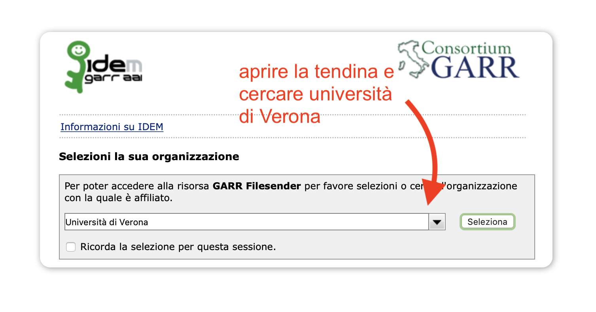
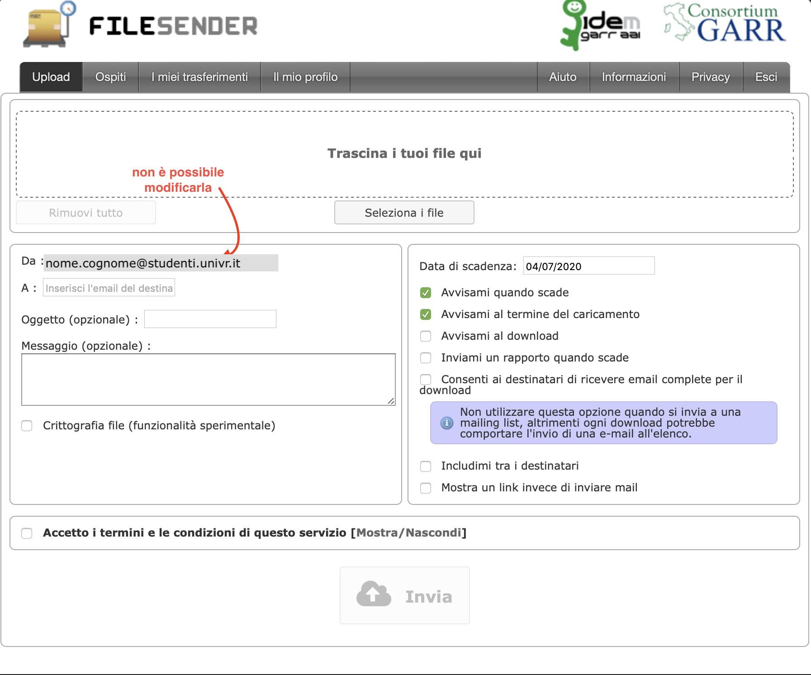
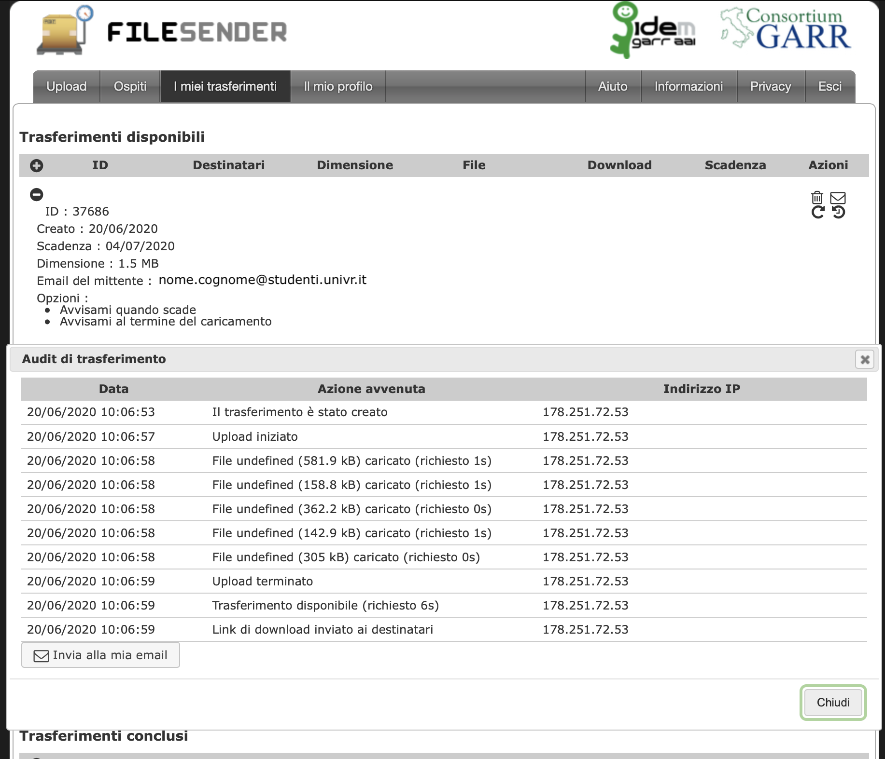
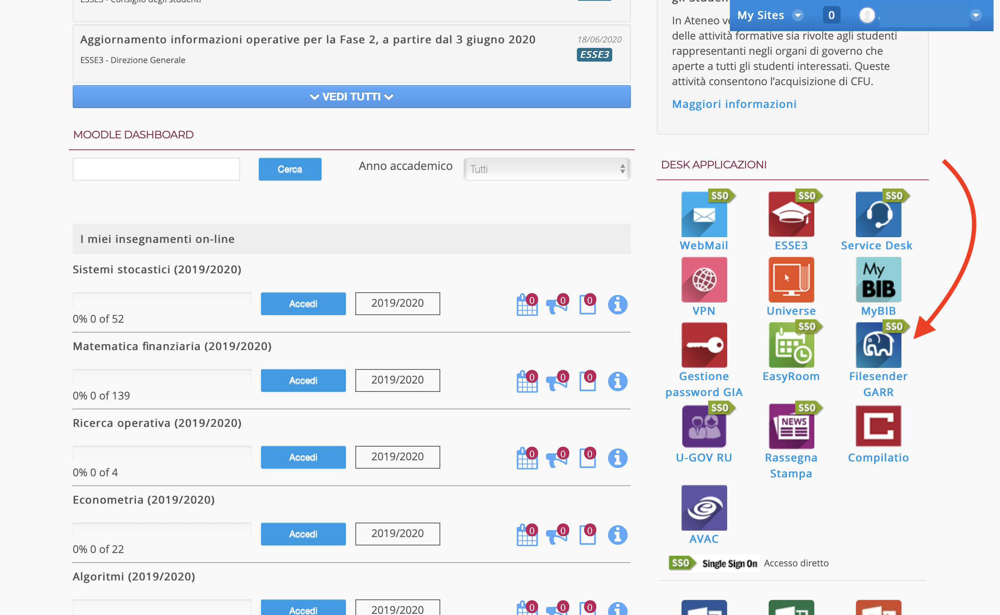

# COME CONSEGNARE IL TUO LAVORO AL TERMINE DELL'ESAME

La mappa ti avrà guidato nel comporre le tue risposte alle varie domande, assicurandosi che ogni materiale prodotto sia stato correttamente collocato entro la cartella del tuo esame in cui hai lavorato e che avevi scaricato ad inizio dell'esame.

Ora vuoi consegnare. Ecco in breve i due passi che devi compiere; entrambi saranno poi espansi meglio in sezioni successive, dovessero servirti:

1. Crea un unico file compresso (formati ed estensioni ammesse: `.7z`, `.zip`, `.tgz`, `.tar.gz`, `.tar`) della cartella esame. Ad esempio:
    ```
    zip -r esameRO-2020.06.30-VR?????
    ```
    dove `VR?????` è la tua matricola, e abbiamo assunto che ti sei collocato nella cartella principale per produrre da terminale lo .zip del folder di tuo interesse.

    Dei formati sopra, il `.tar` è quello meno conveniente, non offrendo esso compressione alcuna ma limitandosi a raccogliere in un singolo file un intero folder.

2. Inviaci il file zip `esameRO-2020.06.30-VR?????.zip` così ottenuto tramite il servizio [Filesender GARR](https://wayf.idem.garr.it/WAYF?entityID=https%3A%2F%2Ffilesender.garr.it%2Fshibboleth&return=https%3A%2F%2Ffilesender.garr.it%2FShibboleth.sso%2FLogin%3FSAMLDS%3D1%26return%3Dhttps%253A%252F%252Ffilesender.garr.it%252F%253Fs%253Dupload%26target%3Dss%253Amem%253Aed4a8d42c54374b7e053e6c5b4dfa282c6052c1a622db2729ea7f08592780514) chiedendo di recapitarlo alla sequenza di indirizzi mail:
```
   romeo.rizzi@univr.it, alice.raffaele@univr.it
```

Le due rimanenti sezioni del presente documento approfondiscono come attrezzarsi per poter portare a termine questi due passi.

## 1. Creazione di file compressi in uno dei formati da noi ammessi

Il software gratuito [B1 Free Archiver](https://b1.org/) ti consente di gestire in semplicità, e da qualsiasi piattaforma (Windows, Mac, Linux), tutti i formati compressi ammessi.

Se usi Windows e già hai installato [il software gratuito ed open source <b>7-Zip</b>](https://www.7-zip.org/) puoi continuare ad utilizzare quello, andrà benissimo.

Lo stesso consiglio vale se sei già organizzato a tuo modo su Mac o Linux, dove per altro è presente nativamente il comando `tar` col quale puoi creare dei file `.tgz` o `.tar.gz` (sconsigliamo i semplici `.tar` poiché è sempre meglio inviare file compressi: oltre ai tempi, si riducono anche i rischi di errore). Da Mac potresti preferire utilizzare semplicemente `Finder` ma assicurati di rimanere entro i formati da noi ammessi.

Se invece vuoi una compressione di tipo zip (o appunto 7z) e devi decidere cosa installarti, aggiungiamo un'ultima alternativa che merita considerazione:
se preferisci operare da linea di comando e/o installarti solo quanto utile allo scopo allora visiona da cima a fondo la breve pagina [Open/Extract 7z File with Freeware on Windows/Mac/Linux](http://www.e7z.org/open-7z.htm).

## 2. Invio di grossi file tramite il servizio GARR Filesender

Accedi a [Filesender GARR](https://wayf.idem.garr.it/WAYF?entityID=https%3A%2F%2Ffilesender.garr.it%2Fshibboleth&return=https%3A%2F%2Ffilesender.garr.it%2FShibboleth.sso%2FLogin%3FSAMLDS%3D1%26return%3Dhttps%253A%252F%252Ffilesender.garr.it%252F%253Fs%253Dupload%26target%3Dss%253Amem%253Aed4a8d42c54374b7e053e6c5b4dfa282c6052c1a622db2729ea7f08592780514) e, selezionata l'Università di Verona come il tuo ente di appartenenza, carica il file compresso `esameRO-2020.06.30-VR?????.7z` (o di altro formato ed estensione) per recapitarlo agli indirizzi mail:
```
   romeo.rizzi@univr.it, alice.raffaele@univr.it
```
Questo è quanto. Ma se ti abbiamo perso percorriamo ora insieme i passi necessari accompagnandoti coi nostri Screenshots.

Parti caricando lo URL [`https://filesender.garr.it/`](https://filesender.garr.it/)  dentro il tuo browser. Così facendo verrai accolto da una schermata di benvenuto:


Premuto il tasto "Accedi" (dove, a seconda di come configurato il tuo locale, potrebbe esserci stato scritto invece "Login"), ti viene chiesto di specificare l'ente consorziato a rete GARR attraverso le cui credenziali autenticarti ed accedere al servizio. Scegli l'Università di Verona.




Una volta scelta l'Università di Verona, potrai accedere al servizio inserendo le tue <b>credenziali GIA</b> esse sono quindi da noi richieste al momento della consegna mentre per poter scaricare il tuo tema individualizzato avrai dovuto utilizzare il link personale che ti avremo fatto avere per mail.

Non appena riconosciuto dal sistema potrai, se lo desideri, impostare le poche opzioni offerte a quel punto. Potrai inoltre inserire un tuo messaggio di accompagnamento.



Ma la cosa importante a questo punto è che tu abbia cura di inserire nel campo del destinatario la lista di indirizzi mail:
```
   romeo.rizzi@univr.it, alice.raffaele@univr.it
```


Devi inoltre avere cura di allegare i file che desideri inviare (a noi basta il compresso della cartella esameRO-data-matricola entro la quale avrai lavorato).

Solo dopo avere aggiunto tale allegato potrai accettare i termini di servizio del servizio per attivare poi il tasto "Invio", pigiando nell'area bassa della schermata dove la freccia bianca dentro la nuvola è l'icona che vorrebbe indicare l'upload.

Una volta concluso l'invio, cliccando su "I miei trasferimenti" e poi su "Vedi i log di trasferimento" ottieni una schermata analoga alla seguente. Essa ti offre conferma dell'avvenuto invio e potrà in qualche modo consentirti di certificarlo qualora qualcosa dovesse andare storto:



Alternativamente, puoi accedere al servizio GARR accedere_a_FilesenderGARR_da_MyUniVR_o_da_moodle da MyUniVR oppure da Moodle:


